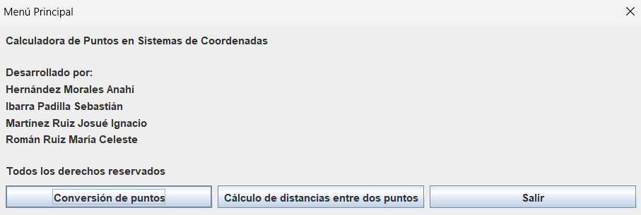
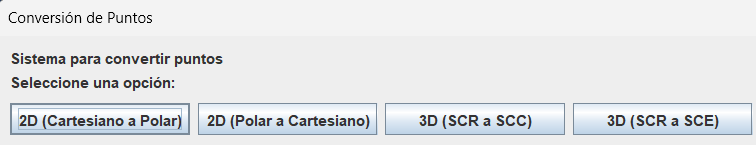
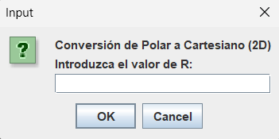
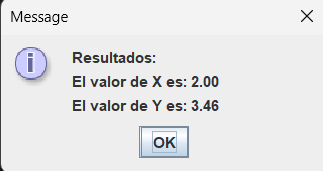

# calculadoraCoordenadas - Calculadora de puntos

> Aplicación de escritorio para **convertir puntos** entre sistemas de coordenadas y
> **calcular la distancia** entre dos puntos.

Programa en **Java** con interfaz de diálogos (**Swing / `JOptionPane`**). Trabaja en 2D
(cartesiano y polar) y en 3D (rectangular, cilíndrico y esférico), con validación de las
entradas y la opción de repetir cada operación sin reiniciar la aplicación.


---

## Tabla de contenido

- [Características](#características)
- [Capturas de pantalla](#capturas-de-pantalla)
- [Sistemas de coordenadas](#sistemas-de-coordenadas)
- [Operaciones](#operaciones)
- [Stack tecnológico](#stack-tecnológico)
- [Requisitos](#requisitos)
- [Compilación y ejecución](#compilación-y-ejecución)
- [Uso](#uso)
- [Autores](#autores)

---

## Características

- **Conversión de puntos** entre los sistemas de coordenadas soportados.
- **Cálculo de distancias** entre dos puntos en cada sistema.
- Interfaz gráfica basada en **cuadros de diálogo** (`JOptionPane`).
- **Validación** de la entrada: avisa con un mensaje de error si no se introduce un número.
- Permite **repetir** cada operación (`s/n`) sin volver a iniciar el programa.
- No requiere dependencias externas (solo la biblioteca estándar de Java).

## Capturas de pantalla

| Menú principal | Conversión de puntos |
|----------------|----------------------|
|  |  |

| Entrada (Polar a Cartesiano) | Resultado |
|------------------------------|-----------|
|  |  |

## Sistemas de coordenadas

| Clave | Sistema                       | Componentes        |
|-------|-------------------------------|--------------------|
| 2D    | Cartesiano                    | `x`, `y`           |
| 2D    | Polar                         | `r`, `θ`           |
| 3D    | Rectangular (SCR)             | `x`, `y`, `z`      |
| 3D    | Cilíndrico (SCC)              | `r`, `θ`, `z`      |
| 3D    | Esférico (SCE)                | `ρ`, `θ`, `φ`      |

## Operaciones

### Conversión de puntos

- 2D: **Cartesiano → Polar** y **Polar → Cartesiano**.
- 3D: conversiones entre **SCR**, **SCC** y **SCE** (ambas direcciones).

### Cálculo de distancias

- 2D: entre dos puntos **cartesianos** y entre dos puntos **polares**.
- 3D: entre dos puntos en **SCR**, **SCC** y **SCE**.

## Stack tecnológico

| Capa             | Tecnología                          |
|------------------|-------------------------------------|
| Lenguaje         | Java (biblioteca estándar)          |
| Interfaz gráfica | Swing (`JOptionPane`, `SwingUtilities`) |
| Entrada/Salida   | Cuadros de diálogo y consola        |

## Requisitos

- **JDK 8** o superior (no se necesitan librerías adicionales).

## Compilación y ejecución

```bash
javac calculadoraEmergent.java
java calculadoraEmergent
```

También puedes ejecutar la clase
[`calculadoraEmergent`](calculadoraEmergent.java) directamente desde tu IDE.

## Uso

1. Al iniciar se muestra el **Menú Principal**:

   | Opción | Acción                              |
   |--------|-------------------------------------|
   | 1      | Conversión de puntos                |
   | 2      | Cálculo de distancias entre 2 puntos|
   | 3      | Salir                               |

2. En **Conversión de puntos**, elige el tipo de conversión (2D o 3D) e introduce los
   valores que se solicitan en cada diálogo.
3. En **Cálculo de distancias**, elige el sistema y captura las coordenadas de ambos puntos.
4. El **resultado** se muestra en un cuadro de diálogo.
5. Responde `s` para realizar otra operación o `n` para volver al menú.

## Autores

- **Hernández Morales Anahí**
- **Ibarra Padilla Sebastián**
- **Martínez Ruiz Josué Ignacio** - [@Lalocarrito](https://github.com/Lalocarrito)
- **Román Ruiz María Celeste**
